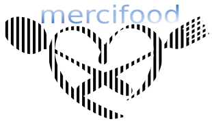

# mercifood

## Description
Mercifood est une application web qui permet de partager de la nourriture autour de soi.  Un utilisateur souhaitant cuisiner aura la possibilité de mettre à la disposition d’autres utilisateurs, proches de chez lui, les informations relatives à son plat.  Ces informations contiennent les aliments qui composent son plat à partager, le nombre de personnes maximum, il aura aussi la possibilité d’ajouter des photos. 
Les utilisateurs intéressés pourront ensuite réserver le plat qui leur convient, et auront la possibilité de laisser une évaluation sur leur expérience.

## Liens 
### Documentation du projet :  
https://docs.google.com/document/d/1OBh7o7FuDC9oR35qzqbcNSBLLMZldV3KDQhy88QaowY/edit#
### Notre Trello : 
https://trello.com/invite/b/waAzqbsU/8732bd015c3d9bbe4b60016357ac182e/mercifood
